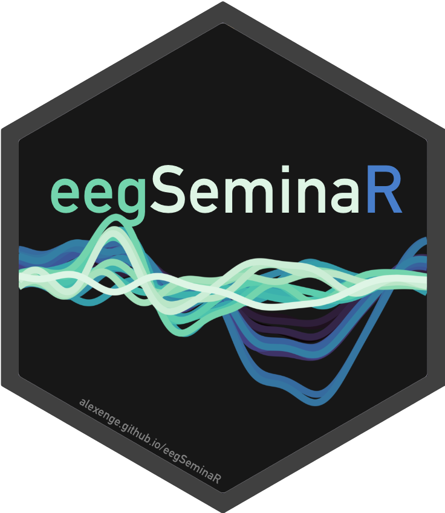

# eegSeminaR 

## 👋 Welcome

This is a MSc-level university seminar on analyzing EEG data in R. It follows a "code first" approach to teach the basics of event-related potential (ERP) analysis, from raw data to statistical modeling and visualization.

The code examples draw heavily on the `eegUtils` package.[^readme-1]

------------------------------------------------------------------------

## 🧭 Course content

| Session       | Vignettes                                                                                                                                                                              | Homework                                                                          |
| ------------- | -------------------------------------------------------------------------------------------------------------------------------------------------------------------------------------- | --------------------------------------------------------------------------------- |
| 29.11.2022    | [1. Introduction to R](https://alexenge.github.io/eegSeminaR/articles/cm1-introduction-to-r.html) [2. Open data](https://alexenge.github.io/eegSeminaR/articles/cm2-open-data.html) | Choose ERP CORE experiment Download ERP CORE data                              |
| 06.12.2022    | 3\. Preprocessing 4. Creating epochs                                                                                                                                                | Apply preprocessing to your data Create epochs                                 |
| 13.12.2022    | 5\. Correcting artifacts 6. Extracting amplitudes                                                                                                                                   | Apply artifact correction and/or rejection Extract single trial ERP amplitudes |
|               | Happy christmas holidays! 🎅🎁🎄                                                                                                                                                          |                                                                                   |
| 03.01.2023    | 7\. Statistics 8. Visualization                                                                                                                                                     | Create at least one statistical model and plot Upload report to Moodle         |
| Add-on topics | 9\. Source localization 10. Time-frequency analysis 11. Multivariate analysis (decoding)                                                                                         |                                                                                   |

------------------------------------------------------------------------

[^readme-1]: Craddock, M. (2022). *eegUtils: Utilities for electroencephalographic (EEG) analysis* (0.7.0). <https://craddm.github.io/eegUtils>

## 🤗️ How to follow along

### a) Interactive -- local (recommended)

-   Follow the instructions on the ["Get started"](https://alexenge.github.io/eegSeminaR/articles/eegSeminaR.html) page to download and install the required software

### b) Interactive -- cloud server

-   Hit this link (or the "Launch binder" button at the top) to open the course materials on a cloud server kindly provided by the Binder project

-   Note that: (a) Launching the cloud server might take a couple of minutes, (b) resources (CPUs and memory) are limited, and (c) changes you make to the code will be lost at the end of the session

### c) Static

-   Read through a static version of the [course materials](https://alexenge.github.io/eegSeminaR/articles/cm1-r-coding-basics.html) from your web browser

-   Does not allow you to run and/or modify any of the code
