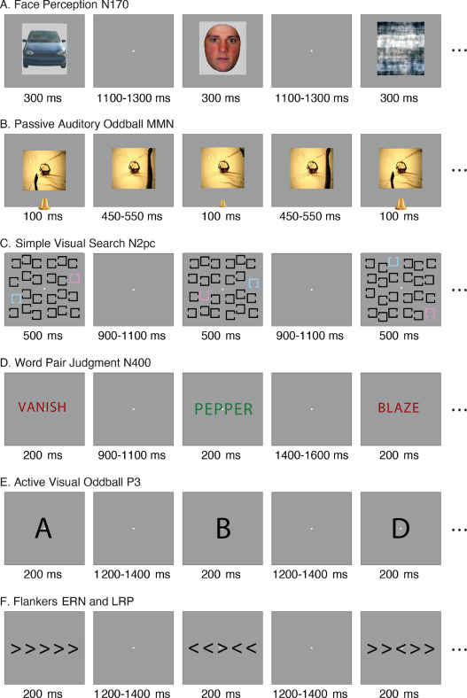
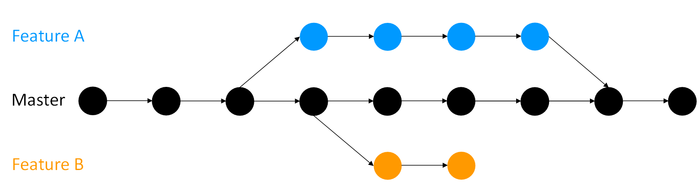

> 🎯 **GOALS**
>
> *Learning how Open Data can help making research more transparent and sustainable, plus getting an overview over one example of an open EEG dataset (ERP CORE).*

## 2.1 Research we can trust

{alt="The replication crisis in psychology. Source: Harvard University" fig-align="center" width="300"}

***Figure 2.1a** The replication crisis in psychology.*[^1]

-   We want (psychological) research findings to be trustworthy

-   At the very least, other researchers that repeat an experiment or analysis should be able to get the same results

{width="500"}

***Figure:** Terminology for trustworthy research.*[^2]

-   Sharing research data helps to establish **reproducibility** and **robustness**

-   Pre-registering one's analysis and sharing materials and protocols helps to establish **replicability** and **generalizability**

[^1]: **Source:** [Harvard University](https://projects.iq.harvard.edu/psychology-replications/home)

[^2]: **Source:** [The Turing Way](https://the-turing-way.netlify.app/reproducible-research/overview/overview-definitions.html)

## 2.2 Open research data

+------------------------------------------------------------------------+-------------------------------------------------------------+
| Advantages of Open Data                                                | Disadvantages of Open Data                                  |
+========================================================================+=============================================================+
| -   Others can reproduce your analysis                                 | -   Privacy concerns -\> Informed consent, pseudonymization |
|                                                                        |                                                             |
| -   Others can probe the robustness of your results                    | -   Additional effort in preparing and documenting the data |
|                                                                        |                                                             |
| -   Others can analyze their own research questions                    | -   Fear of getting "scooped"                               |
|                                                                        |                                                             |
| -   Others can use it for methods development or teaching              |                                                             |
|                                                                        |                                                             |
| -   You have a (well-documented) backup of the data                    |                                                             |
|                                                                        |                                                             |
| -   You will get cited when others use your data                       |                                                             |
|                                                                        |                                                             |
| -   Study participants and taxpayers get more for their time and money |                                                             |
+------------------------------------------------------------------------+-------------------------------------------------------------+

## 2.3 Standardizing data

-   **Brain Imaging Data Standard (BIDS)** = a standardized way of organizing neuroimaging (e.g., fMRI, EEG) data for easier sharing and reuse


***Figure:** Example EEG dataset in BIDS format.*[^3]

-   Folders organized by subjects (`sub-001/`, `sub-002/`, etc.), session (`ses-01`, `ses-02`, etc., if applicable) and imaging modality (`T1w` -- structural MRI, `func` -- functional MRI, `eeg` -- EEG recordings, etc.)

-   Raw data files (e.g., `.set`/`.fdt` for EEG) are accompanied by metadata (e.g., in `.json` format)

    -   Meta-data contains info about the task, the scanner, etc.

-   Additional dataset-wide files like `dataset_description.json`, `participants.tsv`, `README`

[^3]: **Source:** Pernet, C. R., Appelhoff, S., Gorgolewski, K. J., Flandin, G., Phillips, C., Delorme, A., & Oostenveld, R. (2019). EEG-BIDS, an extension to the brain imaging data structure for electroencephalography. *Scientific Data*, 6(1), Article 1. <https://doi.org/10.1038/s41597-019-0104->

## 2.4 ERP CORE dataset

-   **ERP Compendium of Open Resources and Experiments (ERP CORE)**[^4] = an open dataset with data from six different EEG experiments

-   Each experiment was optimally designed to elicit a certain ERP component (more on that later)

{width="400"}

***Figure:** Tasks in the ERP CORE dataset.*[^5]

-   Each experiment completed by the same 40 participants (25 female, 15 male, age 21.5 ± 2.9 years)

-   30 EEG electrodes (10/20 system) + 3 EOG electrodes (eye movements)

-   Sampling rate (= number of recorded EEG voltages per second) of 1024 Hz

[^4]: Kappenman, E. S., Farrens, J. L., Zhang, W., Stewart, A. X., & Luck, S. J. (2021). ERP CORE: An open resource for human event-related potential research. *NeuroImage*, *225*, 117465. <https://doi.org/10.1016/j.neuroimage.2020.117465>

[^5]: **Source:** Kappenman, E. S., Farrens, J. L., Zhang, W., Stewart, A. X., & Luck, S. J. (2021). ERP CORE: An open resource for human event-related potential research. *NeuroImage*, *225*, 117465. <https://doi.org/10.1016/j.neuroimage.2020.117465>

## 2.5 Downloading data

-   Manually from the Open Science Framework (<https://osf.io/thsqg/>) or using the R package `erpcore`[^6]

-   Start by creating an empty data directory

    -   `here()` function from the `here` package to create *relative* file paths (hence reproducible on different machines and operating systems)

```{r}
(data_dir <- here::here("data/n170"))
dir.create(data_dir, recursive = TRUE)
```

-   Then actually download the ERP CORE data

    -   `"n170"` to get only the data from the face percetion (N170) experiment

    -   `"bids"` type to get data in BIDS format

    -   Only download the first of the 40 subjects for now

```{r, message=FALSE}
erpcore::get_erpcore(
  component = "n170",
  dest_path = data_dir,
  type = "bids",
  subjects = "sub-001"
)
```

> ✍️ **EXERCISE**
>
> *Open the `data/n170` directory in the file explorer and take a look at the different files that were downloaded. Can you figure out the purpose for all of them?*

[^6]: Craddock, M. (2021). *erpcore: Download ERP CORE data*. <https://github.com/eegverse/erpcore>

## Further reading

-   Gewin, V. (2016). Data sharing: An open mind on open data. *Nature*, *529*(7584), Article 7584. <https://doi.org/10.1038/nj7584-117a>

-   Kathawalla, U.-K., Silverstein, P., & Syed, M. (2021). Easing into open science: A guide for graduate students and their advisors. *Collabra: Psychology*, *7*(1). <https://doi.org/10.1525/collabra.18684>

-   Pernet, C. R., Appelhoff, S., Gorgolewski, K. J., Flandin, G., Phillips, C., Delorme, A., & Oostenveld, R. (2019). EEG-BIDS, an extension to the brain imaging data structure for electroencephalography. *Scientific Data*, *6*(1), Article 1. <https://doi.org/10.1038/s41597-019-0104-8>

## Add-on topics

### 2.6 Version control

-   For full transparency and reproducibility, we need to share not just our data but also our code

-   Ideally not just the final version (e.g., upload script on OSF), but the full history

-   Also helpful for your future self to understand what you did 6 months ago

-   **Version control** tools like git are very powerful for this:

    1.  Make your project folder a git repository

    2.  Write/edit code

    3.  Take a snapshot ("commit") of the code if you're happy with it

    4.  Include a helpful commit message for your future self or collaborators

    5.  Try out new stuff while always being able to revert to any previous commit

{width="500"}

***Figure:** Tracking the history of your code using git commits (circles) and branches (arrows)*[^7]

-   Code in git repositories can be shared online on websites like GitHub or GitLab

-   For an intro to git and how to use it together with RStudio, check out this free online book[^8]

[^7]: **Source:** [The Turing Way](https://the-turing-way.netlify.app/reproducible-research/vcs/vcs-workflow.html)

[^8]: Bryan, J., the STAT 545 TAs, & Hester, J. (2022). *Happy Git and GitHub for the useR*. <https://happygitwithr.com/>
