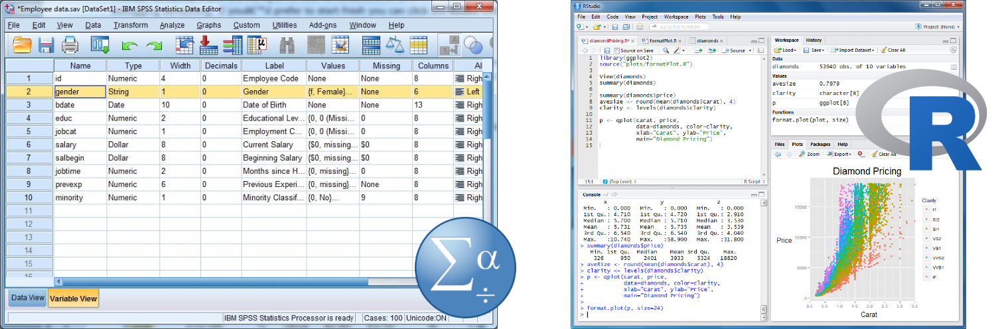
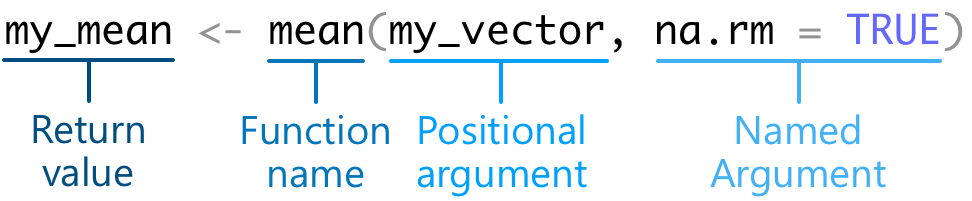

> **🎯 GOALS**
>
> -   *Learn how to calculate in R and store the results as a variable*
> -   *Know the most important types of data structures in R*
> -   *Learn to use and search for functions*
> -   *Learn how to install and use packages*

## 1.1 Intro: Milk


-   For complex tasks, there are multiple ways to achieve the goal

-   Some of these ways are more effective than others

-   People don't always naturally gravitate towards these; they need to be taught



## 1.2 Doing math

-   Think of R like a fancy pocket calculator: You give it (numerical) inputs, it gives you an output

-   For example: Multiplying two numbers 🎉

-   In RStudio, hit the green ▶️ symbol to run the R code and see the output below

```{r}
42 * 2
```

> **✍️ EXERCISE 1.2**
>
> *Check the current temperature for Berlin on the internet. Then use R to convert it from degrees Celsius to degrees Fahrenheit. The formula is:* $\text{°C}\times1.8+32$
>
> *Replace the three dots (`...`) with R code and hit the green ▶️ symbol to run it.*

```{r, eval=FALSE}
...
```

## 1.3 Variables

-   The real power of programming languages: Storing the output of a computation as an intermediate result (**variable**) that can be reused for thex computation

-   We assign (define/create) a variable by choosing a custom name (here: `my_var`) and an arrow symbol (`<-`)

```{r}
my_var <- 4 + 4
```

-   Show the current value of a variable:

```{r}
my_var
```

-   Or assign *and* show the variable by putting the assignment in parentheses:

```{r}
(my_other_var <- 3 * 2)
```

-   Re-use a previously defined variable:

```{r}
my_var ^ 2
```

> **✍️ EXERCISE 1.2**
>
> *Re-do the temperature calculation from Exercise 1.1, but this time storing the temperatures in two separate variables.*

```{r, eval=FALSE}
degrees_celsius <- ...
(degrees_fahrenheit <- ...)
```

## 1.4 Data types

-   We've only dealt with numbers, but there's also other types of data

-   **`numeric`**: A number

```{r}
13.4
```

-   **`character`**: A string of letters (must be surrounded by quotation marks)

```{r}
"Hello world"
```

-   **`logical`**: The logical statements `TRUE` and `FALSE`

```{r}
TRUE
```

-   To check the value of a variable (here `my_var`, defined above):

```{r}
class(my_var)
```

-   We often want to want to store not just a single value (number, string, etc.) but multiple ones

-   **`vector`**: A list of elements, where all elements are *of the same type*

    -   Defined using the `c()` function (for "combine")

```{r}
c(1, 5, 8, 21)
```

-   **`data.frame`**: A table, that is, a two-dimensional structure with rows and columns
    -   Each column is a vector

    -   Each column should be given a name (the part before the `=` sign)

```{r}
data.frame(
  country = c("Germany", "UK", "Denmark"),
  population_mil = c(84.1, 67.1, 5.9),
  eu_member = c(TRUE, FALSE, TRUE)
)
```

-   **`list`**: A list of elements, where the elements can be of different types
    -   Extremely powerful because arbitrarily complex (e.g., a list of data frames, a list of lists)

```{r}
list("Hello world!", 42, c("Vector", "inside", "a", "list!"))
```

> **✍️ EXERCISE 1.3**
>
> *As a group, create one vector with your names and another vector with your heights (in cm). Combine these two vectors into a data frame.*

```{r, eval=FALSE}
names <- ...
heights <- ...
(persons <- data.frame(
  ...,
  ...
))
```

## 1.4 Selecting data

-   We often have large amounts of data and want to pick out a subset of them

-   A **numeric index** *n* in square brackets (here: `[5]`) selects the *n*th (here: 5th) element

```{r}
my_vector <- c(2, 3, 5, 7, 11, 13, 17, 19, 23)
my_vector[5]
```

-   A **range of indices** (e.g., 2nd to 4th) or **vector of indices** (e.g., first and third) selects multiple elements

```{r}
my_vector[2:4]
my_vector[c(1, 3)]
```

-   A **logical condition** selects all elements for which the test is `TRUE`

```{r}
my_vector[my_vector > 5]
```

-   Data frames have two dimensions (rows and columns), so we need **two indices** separated by a comma

```{r}
universities <- data.frame(
  city = c("Heidelberg", "Leipzig", "Rostock", "Greifswald"),
  established = c(1386, 1409, 1419, 1456),
  students_k = c(31.5, 29.5, 14.0, 12.0)
)
universities[1, 3]
```

-   Select all rows (or columns) by leaving the respective index **empty**

```{r}
universities[2, ]
```

-   Select **a single column** (i.e., vector) with a dollar sign (`$`) and the column name

```{r}
universities$established
```

-   Again, we can extract only records (rows) that fulfill a certain **logical condition**

```{r}
universities[universities$students_k > 20, ]
```

> **✍️ EXERCISE 1.4**
>
> *TBD*

## 1.5 Functions

-   R can do a lot more than simple mathematical operations

-   Predefined **functions** exist for many types of tasks, e.g., taking the mean of a vector of numbers:

```{r}
my_vector <- c(2, 4, 6, 8)
mean(my_vector)
```

-   Here's how we call the different bits and pieces when using a function:

{width="400"}

-   Each function has a unique **name**

-   **Arguments** of the functions are the inputs that we want the function to do something with

    -   Each argument has the form of `argument_name = value`

    -   The first argument of a function is often the data; it's common to leave its argument name out (making it a *positional* argument)

    -   Arguments are separated from another by commas

```{=html}
<!-- -->
```
-   The **return value** is the output that the function gives back to us

> **✍️ EXERCISE 1.5**
>
> *Intuitively, one might have thought that the way to compute the mean of four numbers would be `mean(2, 4, 6, 8)`. Why doesn't this work?*

> 💡 **NOTE: R can be confusing**
>
> *While not the case for `mean()`, some functions* do *actually take an arbitrary number of positional arguments. An example is `paste()`, which pastes together multiple character strings into one long character string.*
>
> *You can check the help file of a function (more on that below) to see if a function behaves like `mean()`, with a single first element (typically called `x`), or like `paste()`, with an arbitrary number of positional input arguments (indicated by `...` in the help file).*

## 1.6 Getting help

-   To learn more about a function -- its arguments, return value, examples, etc.:

```{r}
help(mean)
```

-   Or via this shortcut:

```{r}
?mean
```

-   But note that this only helps when you know (part of) the function name -- if not, try to ask Google (e.g., "averaging numbers in R")

> **✍️ EXERCISE 1.6**
>
> *Find out the R function to create a vector of random numbers from a normal distribution. Once you know the name of the function, use it to create a vector of 100 numbers with a mean 500 and a standard deviation of 50.*

```{r, eval=FALSE}
random_numbers <- ...
random_numbers
```

## 1.7 Packages

-   R comes with "batteries included" -- it has functions for many different tasks

-   For other, more specialized tasks, functions are often available in additional **packages** that can be downloaded for free from the internet

-   We first need to download and install the package -- this only needs to be done once

```{r, eval=FALSE}
install.packages("cowsay")
```

-   Next we load the package -- this needs to be done every time we restart our R session

```{r}
library(cowsay)
```

-   Finally, we can use one of the functions from the package:

```{r}
say("What a cool function!")
```

-   We can also skip the `library(package_name)` step by directly specifying the package of the function:

```{r}
cowsay::say("This also works!", by = "cow")
```

## Further reading

-   McNeill, M. (2015). *Base R cheatsheet*. RStudio cheatsheets. <https://github.com/rstudio/cheatsheets/blob/main/base-r.pdf>

-   Navarro, D. (2018). Getting started with R. In *Learning statistics with R: A tutorial for psychology students and other beginners* (pp. 37--71). <https://learningstatisticswithr.com/lsr-0.6.pdf>

## Add-on topics

### 1.8 Custom functions

-   In addition to the function in base R and published packages, we can write our own ones:

```{r}
say_dude <- function(what, by = "cat") {
  what <- paste0(what, ", dude!")
  cowsay::say(what, by)
}
say_dude("Nice function")
```

-   Simple functions like this can also be defined on one line:

```{r}
say_dude <- function(what, by = "cat") cowsay::say(paste0(what, ", dude!"))
```

> **✍️ EXERCISE 1.9**
>
> *Write a custom function that implements the Celsius-to-Fahrenheit conversion from Exercise 1.1.*

```{r, eval=FALSE}
celsius_to_fahrenheit <- ...
celsius_to_fahrenheit(19.3)
```

### 1.9 Repeating stuff

-   We often want to repeat the same operation on multiple inputs

-   Let's assume we have a couple of friends and want to create a friendly message for each of them

```{=html}
<!-- -->
```
-   The naive approach:

```{r}
messages <- character()
messages[1] <- paste("Hello", "Ezra")
messages[2] <- paste("Hello", "Tom")
messages[3] <- paste("Hello", "Samantha")
messages
```

-   Better: Using a **for loop**

```{r}
friends <- c("Ezra", "Tom", "Samantha")
messages <- character()
for (i in 1:length(friends)) {
  messages[i] <- paste("Hello", friends[i])
}
messages
```

-   Even better: **Applying a function** to each element

```{r}
friends <- c("Ezra", "Tom", "Samantha")
greet <- function(x) paste("Hello", x)
(messages <- lapply(friends, greet))
```

-   Best of all: Making use of R's **vectorization** of inputs (but this only works for simple functions)

```{r}
friends <- c("Ezra", "Tom", "Samantha")
(messages <- paste("Hello", friends))
```
