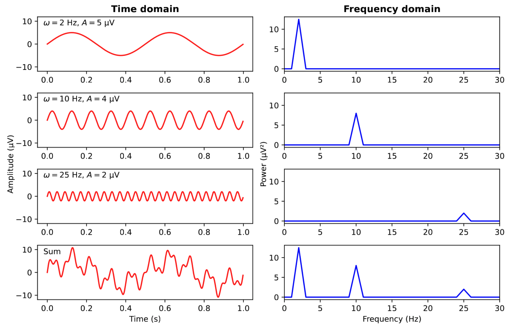

> 🎯 **GOALS**
>
> -   *Learn how to load EEG data into R*
> -   *Visually inspect the raw EEG signal*
> -   *Understand the basics of frequency-domain filtering*

## 3.1 Loading EEG data

-   Loading required packages:

    -   `here` for working with file paths

    -   `eegUtils` for working with EEG data (Craddock, 2022)

```{r, message=FALSE}
library(here)
library(eegUtils)
```

-   Downloaded ERP CORE data is in `data/n170` (see Section 2.6)

-   Data is in BIDS format; each subject has it's own `sub-XXX/eeg` sub-directory

-   We need to find the `.set` file for loading the EEG data

```{r}
bids_dir <- here("data/n170")
set_file <- here(bids_dir, "sub-001", "eeg", "sub-001_task-N170_eeg.set")
file.exists(set_file)
```

-   `eegUtils` has functions for loading ("importing") raw EEG data from various file formats into R, including the `.set` format used by ERP CORE

```{r}
(dat_raw <- import_set(set_file))
```

-   Let's see what type of data we've got:

```{r}
class(dat_raw)
```

-   `eeg_data` is a custom class defined by `eegUtils` -- It's a big list with many sub-components (see `?eeg_data`)

```{r}
str(dat_raw)
```

-   The **actual EEG data** are in a data frame callsed `signals`

    -   Each **row** is one **sample** (time point)[^1]

    -   Each **column** is one **channel** (EEG/EOG electrode)

    -   Each **value** is the **EEG voltage** (in microvolts; µV) measured at this time sample and channel

-   The other parts of the `eeg_data` contain useful **meta-information**, some of which will become important in later sections

[^1]: Technichally, the EEG gets recorded by the EEG electrodes in a continuous (analog) fashion, meaning it continously evolves over time. The discrete time steps that we're dealing with here were created by the EEG amplifier during the *digitization* step of the online EEG recording.

## 3.2 Viewing the data

-   It's usually a good idea to start any analysis by **visually check the raw data**, and doing so again at multiple steps throughout the analysis pipeline (quality control)

```{r, eval=FALSE, message=FALSE}
browse_data(dat_raw)
```

-   Check out multiple time points ("Display start time") and switch between the "Individual" view, plotting all channels below one another, and the "Butterfly" view, plotting all channels on top of each other

> ✍️ **EXERCISE 3.2**
>
> *Inspect the data at different time points and channels. Note down any features of data you find interesting and potentially relevant to deal with in our analysis.*

-   Remember to click "Done" or you will not be able to continue with running the next piece of code

## 3.3 Loading channel locations

-   Some steps (e.g., making plots) require R to know the **relative position of channels** on the scalp

-   For some EEG file formats, this is loaded directly with the raw data, but here we need to electrode locations manually:

```{r}
dat_raw <- electrode_locations(dat_raw, montage = "biosemi64", overwrite = TRUE)
dat_raw$chan_info
```

```{r, warning=FALSE}
plot_electrodes(dat_raw, interact = TRUE)
```

-   The correct `"biosemi64"` locations are directly provided by `eegUtils`, but we could also have used the `electrodes.tsv` file from the BIDS structure

## 3.4 Downsampling

-   The **sampling rate** defines the number of EEG voltages we've recorded per second (= Hertz):

```{r}
dat_raw$srate
```

-   This means that each pair of samples is less than 1 ms apart!

```{r}
1 / dat_raw$srate
```

-   We typically don't need *that* much temporal resolution,[^2] so it is often useful to **downsample** the data

```{r}
dat_downs <- eeg_downsample(dat_raw, q = 4.0) # q is the downsampling factor
```

-   This reduces our computer's memory load and will make subsequent computations faster

```{r}
show_size_mb <- function(x) format(object.size(x), units = "MB")
lapply(list(raw = dat_raw, downsampled = dat_downs), show_size_mb)
```

[{fig-align="center" width="300"}](https://imgflip.com/memegenerator)

[^2]: This is because both the *cognitive processes* that we are interested in (e.g., perception, language, memory) and the *biological processes* that we detect with the EEG (mostly post-synaptic potentials) unfold on the orders of 10--100 ms rather than 1 ms.

## 3.5 Re-referencing

-   During recording ("online"), each electrode is measuring the *difference* in voltage compared to the reference electrode

-   During preprocessing ("offline"), we typically choose a new reference:

    -   **Average reference**: Comparing the voltage to the average of all scalp channels (excluding EOG, EMG, etc.)

    -   **Linked mastoids**: Comparing the voltage to the average of the mastoid channels (M1 and M2)

```{r}
eog_channels <- c("HEOG_left", "HEOG_right", "VEOG_lower")
dat_reref <- eeg_reference(dat_downs, ref_chans = "average", exclude = eog_channels)
```

[](https://pressrelease.brainproducts.com/referencing/)

## 3.6 Filtering

-   Insight by **Joseph Fourier** (1768--1830): Every complex signal can be described by a sum of sine waves
    -   The **frequency** (in Hz) of a sine wave describes how fast it repeats itself

{width="600"}

-   Also true for the EEG, with different parts of the signal having their own frequencies:

| Frequencies       | Typical role                     |
|-------------------|----------------------------------|
| \< 0.1 Hz         | Electrode drift, sweat artifacts |
| 0.1--4 Hz (delta) | Slow-wave sleep                  |
| 4--8 Hz (theta)   | Drownsiness, idling              |
| 8--13 Hz (alpha)  | Relaxing, inhibition             |
| 13--30 Hz (beta)  | Active thinking, alertness       |
| 30--80 Hz (gamma) | Binding, consciousness (?)       |
| 50 Hz (US: 60 Hz) | Power line noise                 |
| \> 80 Hz          | Muscle artifacts                 |

-   Most brain activity detectable with EEG happens between 0.1--30 Hz

-   Idea of **filterting**:

    1.  Converting the time-domain EEG into the frequency domain (Fourier transform)
    2.  Removing (resp. attenuating) signal at certain frequencies
        -   A *low-pass* filter removes fast frequencies (e.g., \> 30 Hz)

        -   A *high-pass* filter remove slow frequencies (e.g., \< 0.1 Hz)

        -   A *band-pass* filter is a combination of a low-pass filter and a high-pass filter

        -   A *band-stop* filter removes a narrow frequency range (e.g., at 50 Hz)
    3.  Converting "cleaned" signal back into the time domain

```{r}
dat_filt <- eeg_filter(dat_reref, low_freq = 0.1, high_freq = 30.0)
```

> ✍️ **EXERCISE 3.5**
>
> *Use the data browser and compare the filtered data with raw (downsampled) data at a certain time point. Repeat the filtering step but making one of the two cutoff frequencies more aggressive (that is, make either the lower cutoff frequency higher or the higher cutoff frequency lower). What advantages and disadvantages could this have?*

```{r, eval=FALSE, message=FALSE}
...
```

> 💡 **NOTE: There's a lot more to filters**
>
> *While the idea of and the code for filtering looks relatively simple, filtering is actually a huge topic and an active area of research (and debate). There are many different types of filters and each of them has many more parameters than just their cutoff frequency (e.g., filter length, transition bandwith, delay, direction).*
>
> *Each of these parameters should be choosen such that the filter (a) removes as much of the unwanted signals as possible while (b) not distorting the part of the signal that we do care about. For example, it has been shown that using a low-pass filter with too high a cutoff (e.g., 1 Hz instead of 0.1 Hz) can introduce artificial "bumps" in the data that can be mistaken for true ERP components (Tanner et al., 2015).*
>
> {width="300"}

-   Let's save our preprocessed (that is, cleand and filtered) data for the next step[^3]

```{r, warning=FALSE}
deriv_dir <- here(bids_dir, "derivatives", "eegUtils", "sub-001", "eeg")
preproc_file <- here(deriv_dir, "sub-001_task-N170_desc-preprocessed_eeg.rds")
dir.create(deriv_dir, recursive = TRUE)
saveRDS(dat_filt, preproc_file)
```

[^3]: Note that there's not yet a final standard for the organization of BIDS derivatives (that is, processed outputs produced from BIDS data). Here we'll losely follow the BIDS conventions (e.g., using a subject-specific `eeg` folder), but for time reasons we'll cut some corners (e.g., not creating `.json` metadata).

## References

-   Tanner, D., Morgan-Short, K., & Luck, S. J. (2015). How inappropriate high-pass filters can produce artifactual effects and incorrect conclusions in ERP studies of language and cognition. *Psychophysiology*, *52*(8), 997--1009. <https://doi.org/10.1111/psyp.12437>

```{r, include=FALSE, eval=FALSE}
filt <- eeg_filter(eeg, 1, 10)
epo <- epoch_data(filt, n170_events, time_lim = c(-0.2, 0.8))
epo <- select_elecs(epo, c("HEOG_left", "HEOG_right", "VEOG_lower"), keep = FALSE)
epo <- rm_baseline(epo, time_lim = c(-0.2, 0.0))
library(ggplot2)
plot_butterfly(epo, time_lim = c(0.0, 0.6)) +
  theme_void() +
  scale_color_viridis_d(option = "mako") +
  theme(
    aspect.ratio = 0.5,
    panel.background = element_rect(fill = NA, color = NA),
    legend.position = "none"
  ) -> p
p$layers[2:3] <- NULL
p$layers[[1]]$aes_params$size <- 4.0
p$layers[[1]]$aes_params$alpha <- 1.0
p

ggsave("butterfly.png")
```
