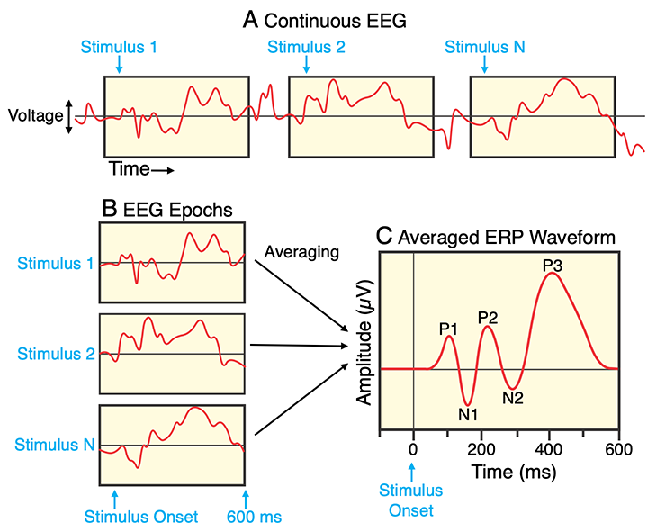

> 🎯 **GOALS**
>
> *Converting our continuous (preprocessed) EEG data into epochs, that is, short segments around our events of interest (e.g., stimuli or responses).*

## 4.1 Read preprocessed data

-   Load preprocessed (re-referenced and filtered) data:

```{r, message=FALSE}
library(here)
library(eegUtils)
```

```{r}
bids_dir <- here("data/n170")
deriv_dir <- here(bids_dir, "derivatives/eegUtils/sub-001/eeg")
preproc_file <- here(deriv_dir, "sub-001_task-N170_desc-preprocessed_eeg.rds")
dat_preproc <- readRDS(preproc_file)
```

## 4.2 Event codes

-   Significant "events" (e.g., stimuli, responses) are marked in the EEG recording by unique **event codes**

-   The meaning of the codes are explained in a specific file in BIDS:

```{r}
events_file <- here(bids_dir, "task-N170_events.json")
print_file <- function(file) writeLines(readLines(file, warn = FALSE))
print_file(events_file)
```

-   Relevant for the N170 effects: Face stimuli (codes `1` to `40`) vs. car stimuli (codes `41` to `80`)

```{r}
event_codes <- c(1:80)
epoch_labels <- ifelse(event_codes <= 40, "face", "car")
```

> ✍️ **EXERCISE**
>
> *Can you come up with a different way to construct the `epoch_labels` vector? Here's one idea if you get stuck.*[^1]

```{r, eval=FALSE}
...
```

[^1]: One way would be to *repeat* (check `?rep`) each value (`"face"` and `"car"`) 40 times, and then combining them into one vector.

## 4.3 Construct epochs

-   Knowing the event codes, we can "cut out" our epochs around them

{width="400"}

***Figure:** Extracting epochs from the continuous EEG, time-locked to stimulus onset.*[^2]

-   Typically including 100 or 200 ms *before* stimulus onset as a baseline period (see below)

```{r}
dat_epo <- epoch_data(
  dat_preproc,
  event_codes,
  time_lim = c(-0.2, 0.8),
  epoch_labels = epoch_labels
)
```

> ✍️ **EXERCISE**
>
> *Check the `epochs` and `timings` tables of the new object. Compare them to the ones from the continuous (clean) data.*

```{r, eval=FALSE}
...
```

-   A useful way to plot epochs is an "ERP image":

    -   X-axis: Time relative to stimulus onset

    -   Y-axis: Trial number (or any other sorting, e.g., by reaction time)

    -   Colors: EEG amplitude

```{r}
erp_image(dat_epo, electrode = "PO8", smoothing = 1)
```

[^2]: **Source:** Luck, S. J. (2022). A very brief introduction to EEG and ERPs. In *Applied event-related potential data analysis*. LibreTexts. [Open access link](https://socialsci.libretexts.org/Bookshelves/Psychology/Book%3A_Applied_Event-Related_Potential_Data_Analysis_(Luck)/12%3A_Appendix_1%3A_A_Very_Brief_Introduction_to_EEG_and_ERPs)

## 4.4 Baseline correction

-   Trials will differ in their overall amplitude, e.g., due to drifts and slow artifacts

-   This can hide more subtle differences between conditions

-   Solution: Subtract (average) activity during the **pre-stimulus baseline**

```{r}
dat_basl <- rm_baseline(dat_epo, c(-0.2, 0.0))
erp_image(dat_basl, electrode = "PO4", smoothing = 1)
```

> ✍️ **EXERCISE**
>
> *Confirm that the average voltage during the baseline window is actually zero for a single epoch and channel. One approach to do this: Take the baselined epochs and (1) get the relevant indices from the `timings` table (one epoch, all baseline time points), (2) Extract one channel (column) from the `signals` table and index it by the index vector, and (3) compute the mean over these signals.*

```{r, eval=FALSE}
basl_ixs <- dat_basl$timings$epoch == 42 & dat_basl$timings$time < 0.0
basl_signals <- ...
...(basl_signals)
```

-   Save the baseline-corrected epochs so we can re-use them in the next notebook:

```{r}
epo_file <- here(deriv_dir, "sub-001_task-N170_desc-epoched_eeg.rds")
saveRDS(dat_basl, epo_file)
```

## Further reading

-   Craddock, M. (2021). *Event and epoch handling*. eegUtils: Utilities for Electroencephalographic (EEG) Analysis. <https://craddm.github.io/eegUtils/articles/epoch-handling.html>
