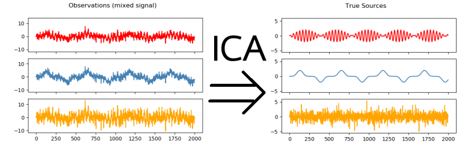

> 🎯 **GOALS**
>
> *Removing large artifacts due to blinks and/or eye movement from the epoched EEG.*

## 5.1 Read epoched data

-   Load packages and preprocessed, baseline-corrected epochs:

```{r, message=FALSE}
library(here)
library(eegUtils)
```

```{r}
bids_dir <- here("data/n170")
deriv_dir <- here(bids_dir, "derivatives/eegUtils/sub-001/eeg")
preproc_file <- here(deriv_dir, "sub-001_task-N170_desc-preprocessed_eeg.rds")
epoch_file <- here(deriv_dir, "sub-001_task-N170_desc-epoched_eeg.rds")
dat_epo <- readRDS(epoch_file)
```

## 5.2 Independent component analysis

-   **Independent component analysis (ICA)** = a statistical technique to separate a multivariate signal (e.g., EEG recordings from different channels) into a number of additive sub-components

{width="700"}

***Figure:** Decomposing a signal into statistically independent components.*[^1]

-   Mathematical details are beyond our scope here, but there are many excellent tutorials (e.g., [^2])

```{r}
n_components <- 15
ica <- run_ICA(dat_epo, method = "fastica", pca = n_components)
```

-   Plot scalp distributions of the extracted ICA components:

    -   Eye-blink and vertical vertical eye movement components: very strong signal at the forehead (`Comp001`)

    -   Vertical eye movement components: Opposite polarities left-frontal versus right-frontal (maybe `Comp008` and/or `Comp009`)

```{r}
topoplot(
  ica,
  component = 1:n_components,
  limits = c(-20, 20),
  chan_marker = "none",
  scaling=0.4
)
```

-   Automatically detect "bad" components based on their correlation with the electroocoulogram (EOG):

```{r}
heog <- c("HEOG_left", "HEOG_right")
veog <- c("FP2", "VEOG_lower")
(bad_components <- ar_eogcor(ica, dat_epo, heog, veog))
```

-   Components #8 (HEOG) and #9 (VEOG) are clear outliers but not above the automatic threshold → Need to adjust the threshold:

```{r}
heog <- c("HEOG_left", "HEOG_right")
veog <- c("FP2", "VEOG_lower")
(bad_components <- ar_eogcor(ica, dat_epo, heog, veog, threshold = 0.6))
```

-   Remove "bad" ICA components from the actual (epoched) data:

```{r}
dat_icacorr <- apply_ica(dat_epo, ica, comps = bad_components)
```

-   Define helper functions to compare uncorrected and corrected epochs visually:

```{r}
extract_epoch <- function(epochs, epoch_no, electrode) {
  epoch_ixs <- epochs$timings$epoch == epoch_no
  data.frame(
    time = unique(epochs$timings$time),
    amplitude = epochs$signals[epoch_ixs, electrode][[1]]
  )
}

compare_epochs <- function(uncorr_epochs,
                           corr_epochs,
                           epoch_no,
                           electrode) {
  require(ggplot2)
  n_samples <- length(unique(uncorr_epochs$timings$time))
  epochs <- list(uncorr_epochs, corr_epochs) |>
    lapply(extract_epoch, epoch_no, electrode) |>
    do.call(what = "rbind")
  epochs$type <- rep(c("uncorrected", "corrected"), each = n_samples) |>
    factor(levels = c("uncorrected", "corrected"))
  ggplot(epochs, aes(x = time, y = amplitude, color = type)) +
    geom_line() +
    labs(x = "Time (s)", y = "Amplitude (µV)", color = NULL) +
    ggtitle(paste0("Epoch #", epoch_no, ", channel ", electrode)) +
    theme_minimal()
}

compare_epochs(dat_epo, dat_icacorr, epoch_no = 103, electrode = "FP1")
```

[^1]: **Source:** [Parietal at INRIA-CEA](https://team.inria.fr/parietal/research/statistical-and-machine-learning-methods-for-large-scale-data/faster-independent-component-analysis-for-real-data/)

[^2]: Talebi, S. (2021). *Independent Component Analysis (ICA)*. Towards Data Science. <https://towardsdatascience.com/independent-component-analysis-ica-a3eba0ccec35>

## 5.3 Artifact rejection

-   ICA may not be able to correct all eye movements + other artifacts

-   Additionally reject (i.e., throw away) all epochs where at least one channel exceeds an absolute voltage threshold (e.g., ± 100 µV)

```{r}
# remotes::install_github("alexenge/eegUtils@fix-ar_thresh-reject")
dat_rej <- ar_thresh(dat_icacorr, threshold = c(100, -100), reject = TRUE)
```

{width="300"}

***Figure:** According to a famous ERP textbook*[^3]*, "sometimes the best artifact correction is no artifact correction" (i.e., rejection only).*[^4]

-   Choose threshold carefully → Rejecting many epochs reduces statistical power

-   More sophisticated thresholding approaches exist (e.g., moving window)

-   Save artifact-corrected epochs for later:

```{r}
corr_file <- here(deriv_dir, "sub-001_task-N170_desc-corrected_eeg.rds")
saveRDS(dat_rej, corr_file)
```

[^3]: Luck, S. J. (2014a). Chapter 6: Artifact rejection and correction. In *An Introduction to the Event-Related Potential Technique* (2nd ed., pp. 185--217). MIT Press.

[^4]: **Source:** [imgflip Meme Generator](https://imgflip.com/memegenerator/174489685/They-are-the-same-picture)

## Further reading

-   Luck, S. J. (2014a). Chapter 6: Artifact rejection and correction. In *An Introduction to the Event-Related Potential Technique* (2nd ed., pp. 185--217). MIT Press.

-   Luck, S. J. (2014b). Chapter 6 Supplement: A closer look at ICA-based artifact correction. In *An Introduction to the Event-Related Potential Technique* (2nd ed.). MIT Press. [Open access link](http://mitp-content-server.mit.edu:18180/books/content/sectbyfn?collid=books_pres_0&id=8575&fn=8575_006a_0.pdf)

## Add-on topics

### 5.4 Multiple source eye correction

-   **Multiple source eye correction (MSEC)** = a semi-automatic algorithm to model and correct eye blinks and eye movements

-   Explicitly models the dipole sources of the eye movements (unlike ICA)

-   Requires manual annotation of "true" eye blinks and eye movements, ideally from independent calibration data

-   Available in a commercial software package (BESA)

-   Creates a correction matrix that -- via matrix multiplication -- removes eye movements from the actual data

### 5.5 Regression

-   Much simpler approach than ICA and MSEC: Remove EOG from scalp channels using linear regression

-   Problematic: EOG channels may contain or correlate with brain activity

```{r}
dat_eogreg <- ar_eogreg(dat_epo, heog, veog)
compare_epochs(dat_epo, dat_eogreg, epoch_no = 103, electrode = "FP1")
```
