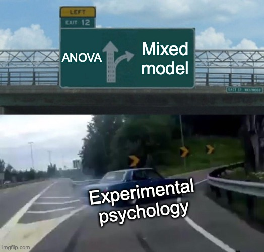

> 🎯 **GOALS**
>
> *Testing if there is a statistically reliable difference in ERP amplitudes (here: N170 component) between experimental conditions (here: faces versus cars).*

## 7.1 Intro: Ants

-   Like ants, scientists can achieve amazing things if they cooperate

-   But sometimes they get lost by blindly following one another


***Figure:** Ants being collectively clever and collectively stupid.*[^1]

[^1]: **Source:** [Imgur](https://imgur.com/KWXSw), [YouTube](https://www.youtube.com/watch?v=LEKwQxO4EZU)

## 7.2 *t*-test

-   We'll start with modeling data for a **single subject** and move to a group analysis (including all 40 ERP CORE participants) in Section 7.4

-   Load required packages:

    -   `lme4` for fitting linear mixed-effects models (see Section 7.4)[^2]

    -   `lmerTest` for obtaining *p* values for linear mixed-effects models[^3]

```{r, message=FALSE}
library(here)
library(lme4)
library(lmerTest)
```

-   Load the single trial mean N170 amplitudes (= one micro-voltage per trial):

```{r}
bids_dir <- here("data/n170")
deriv_dir <- here(bids_dir, "derivatives/eegUtils/sub-001/eeg")
trials_file <- here(deriv_dir, "sub-001_task-N170_trials.csv")
dat_trials <- read.csv(trials_file)
head(dat_trials)
```

-   [Student's *t*-test](https://en.wikipedia.org/wiki/Student%27s_t-test) for the difference between `"car"` trials and `"face"` trials:

```{r}
t.test(amplitude ~ condition, data = dat_trials)
```

-   Conclusion: For participant `sub-001`, face images (as compared to car images) elicit more negative voltages in the N170 time range

[^2]: Bates, D., Mächler, M., Bolker, B., & Walker, S. (2015). Fitting linear mixed-effects models using lme4. *Journal of Statistical Software*, *67*(1), 1--48. <https://doi.org/10.18637/jss.v067.i01>

[^3]: Kuznetsova, A., Brockhoff, P. B., & Christensen, R. H. B. (2017). lmerTest package: Tests in linear mixed effects models. *Journal of Statistical Software*, *82*(13), 1--26. <https://doi.org/10.18637/jss.v082.i13>

## 7.3 Linear regression

-   The *t*-test from Section 7.2 is identical to a simple linear regression model

-   Define model formula:

    -   N170 `amplitude` is predicted (`~`) by an intercept (`1`) and the `condition` effect (faces vs. cars)

```{r}
form_lm <- amplitude ~ 1 + condition
```

-   `lm()` function implicitly codes `"car"` trials with `0` and `"face"` trials with `1`

-   Intercept therefore is the average N170 voltage in car trials

-   Predictor effect (`epoch_labelsface`) is the difference between a face trial and a car trial

-   This effect explains 9% of the variance in the N170 (see $R^2$)

```{r}
mod <- lm(form_lm, dat_trials)
summary(mod)
```

## 7.4 Linear mixed-effects model

-   Modeling the data from **all participants** (= "group analysis") requires a more complex model

    -   Trials from the same participant are correlated with one another (due to individual differences, differences in cap position and conductance, etc.)

    -   Idea of [**linear mixed-effects models (LMMs)**](https://en.wikipedia.org/wiki/Mixed_model): Fit a separate linear regression (as in section 7.3) for each participant and average the regression coefficients[^4]

-   Read data frame with single trial mean N170 amplitudes from all participants:

```{r}
group_file <- here(bids_dir, "derivatives/eegUtils/group_task-N170_trials.csv")
dat_group <- read.csv(group_file)
head(dat_group)
```

-   Define model formula:

    -   **Fixed effects** :

        -   Everything after `~` but not in parentheses

        -   Capture intercept and predictor effect *across* subjects

        -   Usually our effects of interest

    -   **Random effects**:

        -   Everything in parentheses

        -   Capture subject-specific variation in the intercept and in the predictor effect

```{r}
form_lmm <- amplitude ~ 1 + condition + (1 + condition | participant) + (1 | stimulus)
```

-   Fit linear mixed model:

```{r}
mod_lmm <- lmer(form_lmm, dat_group)
summary(mod_lmm)
```

-   Conclusion: In the population from which the ERP CORE participants were drawn, face images (as compared to car images) elicit more negative voltages in the N170 time range

[^4]: This is only true on a rough, conceptual level. In reality, R doesn't estimate separate regression coefficients for each participant but rather just the *variance* of these coefficients across participants, using a iterative approach called (restricted) [maximum likelihood estimation](https://towardsdatascience.com/probability-concepts-explained-maximum-likelihood-estimation-c7b4342fdbb1).

## Add-on topics

### 7.5 Repeated measures ANOVA

-   LMMs used to be difficult to fit before modern computer hardware

-   "Traditional" approach:

    -   For each subject, average all trials from the same condition

    -   Then model the condition effect as a factor in an [**repeated measures analysis of variance (rmANOVA)**](https://en.wikipedia.org/wiki/Random_effects_model)

```{r}
dat_ave <- aggregate(amplitude ~ participant + condition, dat_group, mean)
dat_ave$participant <- factor(dat_ave$participant)
head(dat_ave)
```

```{r}
mod_aov <- aov(amplitude ~ condition + Error(participant), data = dat_ave)
summary(mod_aov)
```

-   In the case of a single predictor variable with two levels, this is equivalent to a paired *t*-test:

```{r}
t.test(amplitude ~ condition, data = dat_ave, paired = TRUE)
```

-   Note that rmANOVA has a number of drawbacks compared to a mixed model:

    -   Independence assumption violated because participant effects and item effects cannot be accounted for simultaneously[^5]

    -   Not robust to unbalanced designs (i.e., different numbers of trials per condition and/or per participant)

    -   Cannot include trial-level covariates (e.g., fatigue)

    -   Cannot include item-level covariates (e.g., word length)

{width="300"}

***Figure:** Mixed models are becoming the standard tool for analyzing data in experimental psychology.*[^6]

[^5]: Bürki, A., Frossard, J., & Renaud, O. (2018). Accounting for stimulus and participant effects in event-related potential analyses to increase the replicability of studies. *Journal of Neuroscience Methods*, *309*, 218--227. <https://doi.org/10.1016/j.jneumeth.2018.09.016>

[^6]: **Source:** [imgflip Meme Generator](https://imgflip.com/memegenerator/Left-Exit-12-Off-Ramp)
